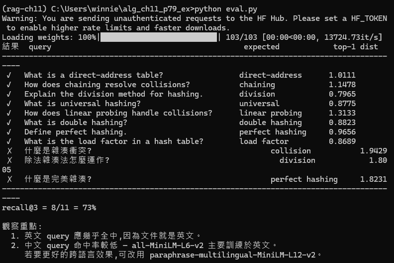
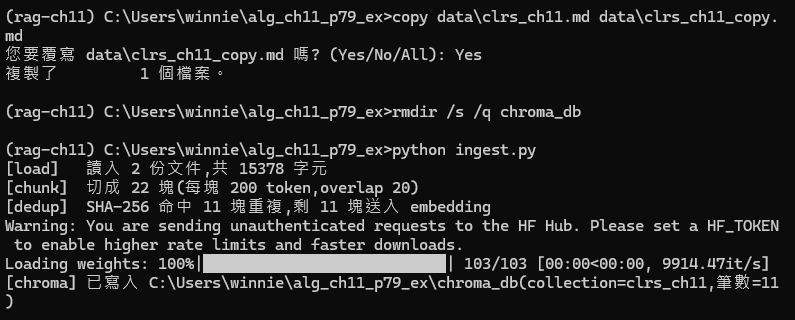

# algo-hw11-rag-chroma
Algorithms HW11 - RAG with LangChain + Chroma
# Algorithms HW11 — rag-chroma
## 學生資訊
- 姓名：[翁歆婷]
- 學號：[B3201673]
- 課程：3468 演算法 1142
## 實驗環境
- 平台：anaconda
- Windows 11
- Anaconda Prompt
- Python 3.11
- conda 環境名稱: `rag-ch11`
## 結果摘要
- 紀錄 四個問題(中英個兩個)的top-3召回結果與 cosine distance。
 
 1.英文 How does chaining resolve collisions?
Top-1  召回結果: clrs11-0002   Cosine Distance: 1.1478
Top-2  召回結果: clrs11-0002   Cosine Distance: 1.1478
Top-3  召回結果: clrs11-0005   Cosine Distance: 1.4972

 2.英文 What is linear probing?
Top-1  召回結果: clrs11-0006   Cosine Distance: 1.4086
Top-2  召回結果: clrs11-0006   Cosine Distance: 1.4086
Top-3  召回結果: clrs11-0007   Cosine Distance: 1.4709

  3.中文 除法雜湊如何運作?
Top-1  召回結果: clrs11-0006   Cosine Distance: 1.8020
Top-2  召回結果: clrs11-0006   Cosine Distance: 1.8020
Top-3  召回結果: clrs11-0005   Cosine Distance: 1.8339

  4.中文 如何解決碰撞？
Top-1  召回結果: clrs11-0006   Cosine Distance: 1.9638
Top-2  召回結果: clrs11-0006   Cosine Distance: 1.9638
Top-3  召回結果: clrs11-0007   Cosine Distance: 1.9804

## 結論
SHA-256 內容雜湊（去重）:在執行ingest.py時，我們重新複製語料並刪除掉原本的chroma_db，但我們有發現他會去偵測重複的雜湊內容，避免重新寫入，因SHA-256本身透過密碼學等方式使得其本身碰撞機率很低，故當遇到一樣的雜湊執時，他會拒絕寫入如下圖

embedding 分桶（檢索）
在執行python ingest.py時，他會自動下載一個Embedding模型，透過all-MiniLM-L6-v2模型轉換成向量並放入chroma_db內，分類並使得語意愈接近的向量可以被分到同區塊(桶)中，且快速找出前五筆向量最相近的資料，類似開放定址法。

metadata inverted index（過濾）
他會找到其中的關鍵字並透過embedding 分桶（檢索）去找出最佳結果，並存入自己的雜湊表內，在下次搜尋出現重複字字樣時會馬上透過其雜湊表找出大致結果(倒排)，或提前在embedding 分桶（檢索）前把不符的資料先消去，類似鏈結法。

## 對應作業
- 作業：3468 演算法 HW11 (Ch11) Problem 8(b)
- 投影片：CLRS 4e Ch11 v4 PPT 第 85 頁
- 實驗指南：本 repo 內 README-11-p79.md